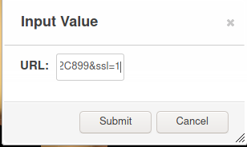

Descrição
=================
Alguns macros úteis para o Roll20 desenvolvidos para agilizar o jogo, diminuir o espaço gasto no chat para rolagem de dados e padronizar as ações dos personagens.

A lista dos macros inclusos no diretório /macros/ podem ser vistos na [lista de macros](#lista-de-macros) no final do README

Guia para iniciantes
=================

Os macros estão sempre indicados pelo nome do arquivo **/macros/nome-do-macro.txt** (com exeção aos macros extras), deve-se copiar o conteúdo todo do arquivo até o final, como por exemplo:

A maioria dos macros foi desenvolvida pensando que os jogadores iriam adicionar os macros relativos à ficha da seguinte forma:

Primeiro, abrir a ficha do personagem:

Selecionar a aba 'Attributes & Abilities' e em seguida clicar em '+Add':

Copiar o conteúdo do macro que deseja e colar da seguinte forma:

Ao salvar o macro (pressionar o botão 'v'), selecionar 'Show in Macro Bar' e ter-se-á uma tela parecida com:

Inicialmente o nome do macro será da forma *charname : habilidade*, para alterar cor e nome basta clicar com o botão direito nesse botão.

> Tenha em mente que os macros do arquivo exemplos, foram criados para personagens especificos, assim para serem utilizados por outros personagens, é necessário editar os pedaços que contenham @{Zikko Bruhnog | atr}, por exemplo, para @{\<nome do seu personagem\> | atr}

Exemplos de alguns macros
=================
## Perícias

A caixa seletora funciona basicamente da mesma forma para o macro de *Atributos*
|                                       |  |
| ------------------------------------------------------------- | ------------------------ |
|   <blockquote>No chat</blockquote> |                          |

## Imagem

|  |  <blockquote>No chat</blockquote> |
| -------------------- | ----------------------------------------------------- |
|                      |                                                       |

## Texto

|  |  <blockquote>No chat</blockquote> |
| --------------------- | ------------------------------------------------------ |
|                       |                                                        |
## XdY+bonus

O macro de d20+bonus funciona de forma similar

|  |  |
| --------------------- | --------------------- |
|  |                       |

No chat:

## Pedágio aos Mortos

|  |  <blockquote>No chat</blockquote> |
| --------------------- | ------------------------------------------------------ |
|                       |                                                        |

Lista de Macros
=================
#### Uso Geral
- Atributos: para rolagem de testes de atributo com seletor para vantagem, desvantagem ou teste normal
- Perícias: para rolagem de perícias com seletor para vantagem, desvantagem ou teste normal
- d20+bonus: para agilizar rolagens de d20 com bônus quaisquer
- XdY+bonus: para facilitar a rolagem de uma quantidade qualquer de dados com número arbitrário de dados com bonus
  
#### Extra
- Imagem: para otimizar o envio de imagens pelo chat
- Texto: para enviar um texto no chat com formato diferente

#### Exemplos (/macros/Exemplos.txt)

+ Pedágio aos mortos (toll the dead): adicionar a magia no roll20, que não está presente na versão grátis, possibilita a rolagem se o inimigo levou dano ou não (1d8 ou 1d12) e rola o número de dados de dano permitidos para cada nível, além de mostrar a CD do teste de resistência, tipo de dano e alcance
+ Mordida do Adran: macro desenvolvido para que o personagem Vampiro da campanha pudesse realizar sua fatídica mordida: 1d20 + modificador de força + bônus de proficiência, dando 1d6 + modificador de força de dano necrótico
